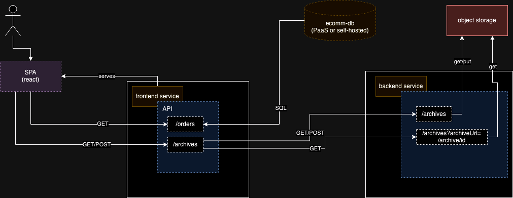

## Overview

The `pandoras-box` application is a multi-service application that is intended for use in security testing. This
application has multiple attack surfaces and convenience features for emulating RCEs in a safe manner. 

### Deployments

The application has two major variants for deployment; all running directly on instances or containers running on
Kubernetes.

* [Instance Deployment](aws/instance)
* [Containerized Deployment](aws/container)

### Attack Details

See [Attacks](attacks)
