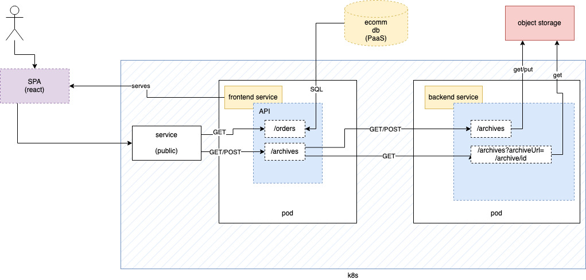

### Containerized Deployment (EKS)



#### Deployments

##### Prerequisites

In order to deploy Pandora's Box you will need AWS credentials, Lacework credentials (API keys), and a Lacework access token.


##### Containerized w/RDS

To deploy Pandora's box with an RDS instance, use the following commands:

```
detc create \
  --plan https://raw.githubusercontent.com/ipcrm/pandoras-box/main/deploy/plans/aws/eks/app-rds.yml \
  --plan https://raw.githubusercontent.com/ipcrm/pandoras-box/main/deploy/plans/aws/eks/infra.yml \
  --apply
```

##### Instances w/StandAlone database

To deploy Pandora's box with a MySQL database hosted within the EKS cluster, run the following command:

```
detc create \
  --plan https://raw.githubusercontent.com/ipcrm/pandoras-box/main/deploy/plans/aws/eks/app.yml \
  --plan https://raw.githubusercontent.com/ipcrm/pandoras-box/main/deploy/plans/aws/eks/infra.yml \
  --apply
```


##### Accessing Application

Once deployed, the URL can be fetched using the following command:

```
detc deployments ecomm-reporter reporter frontend_app_url
```


#### Access Infrastructure

The K8s infrastructure can be accessed via [kube-prompt](https://github.com/c-bata/kube-prompt) using the following
command:

```
detc k8s aws-k8s k8s
```

