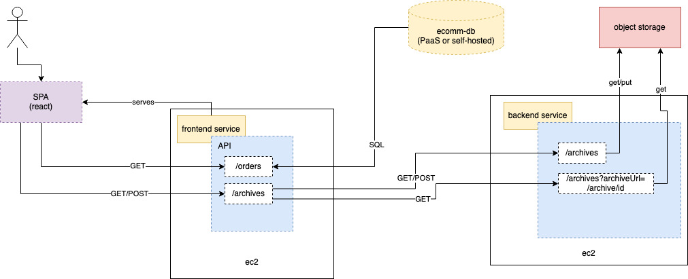

### Instance Deployment



#### Deployments

##### Prerequisites

In order to deploy Pandora's Box you will need AWS credentials, Lacework credentials (API keys), and a Lacework access token.


##### Instances w/RDS

To deploy Pandora's box with an RDS instance, use the following commands:

```
detc create --plan https://raw.githubusercontent.com/ipcrm/pandoras-box/main/deploy/plans/aws/instance-rds.yml --apply
```

##### Instances w/StandAlone database

To deploy Pandora's box with a MySQL database hosted on the backend EC2 instance, run the following command:

```
detc create --plan https://raw.githubusercontent.com/ipcrm/pandoras-box/main/deploy/plans/aws/instance.yml --apply
```


##### Accessing Application

Once deployed, the URL can be fetched using the following command:

```
detc deployments ecomm-reporter deploy-frontend app_url
```


#### Access Infrastructure

To SSH to either host, you can use the `detc ssh` command. See command help for details.
